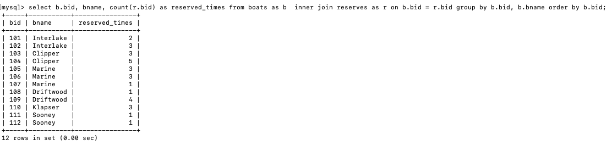

# Problem Set 1 - ECE 464 Database

#### Crystal Yuecen Wang
#### Professor: Eugene Sokolov

## Probelm Set Description:
Use SQL and ORM Sqlalchemy to query information needed from a sailor, boat database
Detailed Description can be found at [Problem Set 1 Description](https://github.com/eugsokolov/ece464-databases/blob/master/assignments/problem-set-1.md)

## Part 1
* Q1
List, for every boat, the number of times it has been reserved, excluding those boats that have never been reserved (list the id and the name).

```sql
SELECT b.bid, bname, count(r.bid) as reserved_times FROM boats as b  inner join reserves as r on b.bid = r.bid group by b.bid, b.bname order by b.bid;

```
 <p align="center">
  
  </p>
  
  * Q2
List those sailors who have reserved every red boat (list the id and the name).

```sql
SELECT s.sid, s.sname FROM sailors as s WHERE NOT  exists (SELECT * FROM boats as b WHERE b.color = 'red' AND NOT exists (SELECT * FROM reserves as r WHERE s.sid = r.sid AND b.bid = r.bid));
```
 <p align="center">
  
  </p>
  
   * Q3
List those sailors who have reserved only red boats.
```sql
SELECT distinct s.sid, s.sname FROM sailors as s, reserves as r, boats as b
WHERE s.sid = r.sid AND b.color ='red' AND r.bid = b.bid AND s.sid NOT in (SELECT s.sid FROM sailors as s, reserves as r, boats as b WHERE s.sid = r.sid AND r.bid = b.bid AND b.color != 'red' );
```
 <p align="center">
  
  </p>

 * Q4
For which boat are there the most reservations?

```sql
SELECT b.bid, b.bname, COUNT(r.bid) as Num_Reservations FROM boats as b, reserves as r
WHERE b.bid = r.bid group by b.bid
order by Num_Reservations DESC limit 1;
```
 <p align="center">
  
  </p>
  
   * Q5
Select all sailors who have never reserved a red boat.
```sql
SELECT s.sid, s.sname FROM sailors as s
WHERE s.sid NOT IN (SELECT r.sid FROM reserves as r INNER JOIN boats as b ON r.bid = b.bid WHERE b.color = 'red')
order by s.sid;
```
 <p align="center">
  
  </p>
  
   * Q6
Find the average age of sailors with a rating of 10.

```sql
SELECT AVG(age) as Average_Age FROM sailors WHERE rating = 10; 

```
 <p align="center">
  
  </p>
  
   * Q7
For each rating, find the name and id of the youngest sailor.

```sql
SELECT s.* FROM sailors as s
INNER JOIN (SELECT rating, MIN(age) as min_age FROM sailors GROUP BY rating) as s1
ON s.rating = s1.rating AND s1.min_age = s.age
ORDER BY s.rating;

```
 <p align="center">
  
  </p>
  
   * Q8
Select, for each boat, the sailor who made the highest number of reservations for that boat.

```sql
SELECT t.bname, t.bid, t.sname, t.sid, MAX(count_res) FROM (SELECT b.bname, r.bid, s.sname, r.sid, COUNT(r.bid) as count_res
FROM reserves as r, sailors as s, boats as b
WHERE r.sid = s.sid AND b.bid = r.bid
GROUP BY r.bid, r.sid
ORDER BY count_res) as t
GROUP BY t.sid, t.bid
ORDER BY t.bid
```
 <p align="center">
  
  </p>


## Part 2
Represent the sailors and boats schema using an ORM - SQLAlchemy and show that it is fully functional by writing tests with a testing framework using the data from part 1 (writing the queries for the questions in Part 1) 
*  [Part2 Code & Testing](part2.py)

## Part 3
Students are hired as software consults for a small business boat rental that is experiencing a heavy influx of tourism in its area. This increase is hindering operations of the mom/pop shop that uses paper/pen for most tasks. Students should explore “inefficient processes” the business may have and propose ideas for improvements - in the form of a brief write-up.
* [Part3 Description](part3_Description.txt)
* [Part3 Code & Testing](part3.py)
* [Part3 sql](part3.sql)


* Example 1 - Weekly Payment
<p align="center">
  
  </p>
  
* Example 2 - Boat Profit
<p align="center">
  
  </p>
