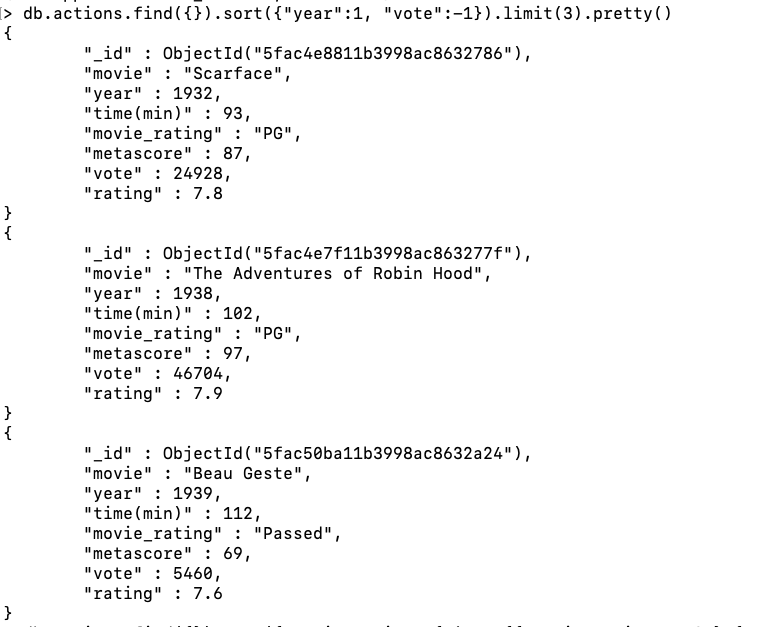

# Problem Set 2 - ECE 464 Database

#### Crystal Yuecen Wang
#### Professor: Eugene Sokolov

## Problem Set Description:
Use Beautifulsoup as web scrapper to scrape action movie informations from [IMDB](https://www.imdb.com/search/title/?genres=action) website. 
Detailed Description can be found at [Problem Set 2 Description](https://github.com/eugsokolov/ece464-databases/blob/master/assignments/problem-set-2.md)

## Web Scrapping and Database Creating
BeautifulSoup is used in order to parse the web page information and process it. For the 8000 action movies I scraped, some of the movies are skipped due to lack of their metadata scores. It took around 30min on my machine to scrape 8000 movies. The data obtained is then inserted into a MongoDB database. Database "movies" is created with "actions" as the collection inside of the database.
*  [Web Scrapping Code](problem_set2.py)

## Sample Queries
Below listed a few queries that runs in [mongo shell](https://docs.mongodb.com/manual/mongo)
* [Query texts](sample_queries.txt)

* Finding the first five movies that has a rating above 8.0:

```
> db.actions.find({"rating":{"$gt": 8.0}}).limit(5).pretty()
```
 <p align="center">
  
  </p>

* Finding the earliest 3 movies in the dataset and sorted in descending vote order:
```
> db.actions.find({}).sort({"year":1, "vote":-1}).limit(3).pretty()
```
 <p align="center">
  
  </p>

* Finding how many movie rating PG or PG-13 the dataset has:

```
> db.actions.find({}).sort({"movie_rating":{"$or":[{"movie_rating":"PG"},{"movie_rating":"PG-13"}]}}).count()
```
 <p align="center">
  
  </p>

* Showing only the votes and the rating for the movie Mulan:

```
> db.actions.find({"movie":"Mulan"},{_id:0, rating:1, vote:1})
```
 <p align="center">
  
  </p>
